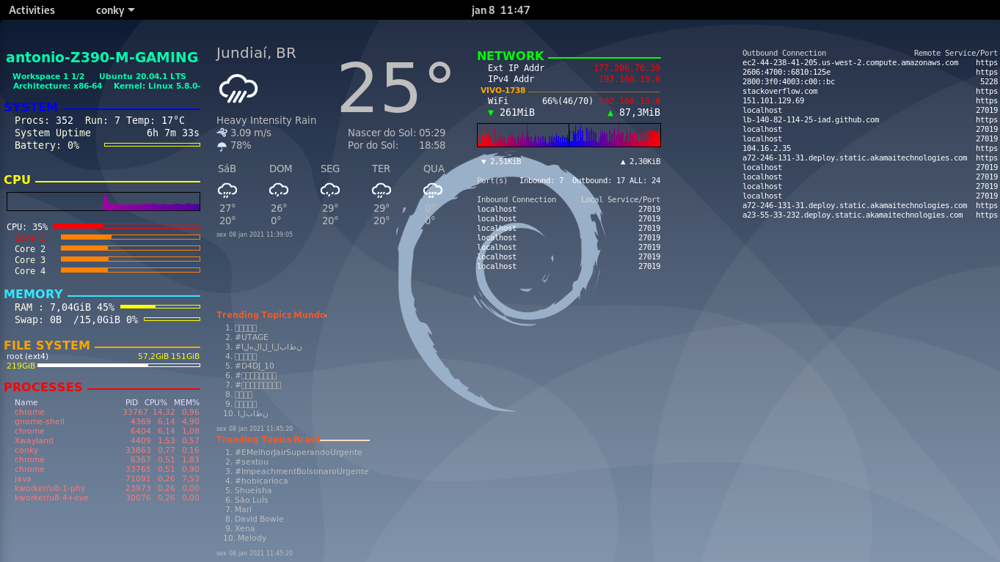
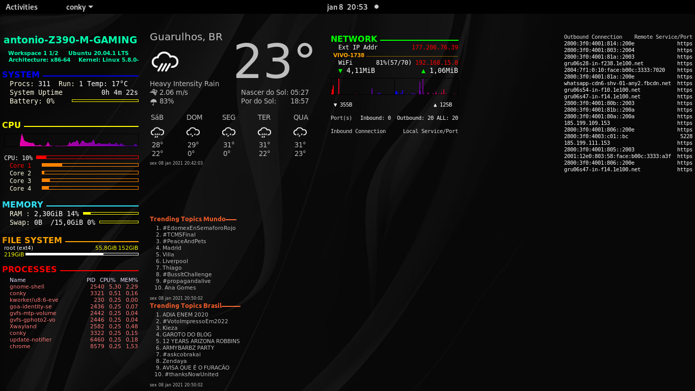

# Install 
### git clone

```
cd ~
git clone https://github.com/antonio24073/.conky.git
```
### conky
install conky, so far it's like this:

```
sudo apt update
sudo apt install curl jq
curl -sL -o conky-x86_64.AppImage \
    $(curl -sL https://api.github.com/repos/brndnmtthws/conky/releases/latest | \
    jq --raw-output '.assets[0] | .browser_download_url')
ls conky-x86_64.AppImage
chmod +x ./conky-x86_64.AppImage
./conky-x86_64.AppImage -C > ~/.conkyrc
```
and test:
```
./conky-x86_64.AppImage
```
or see:
https://github.com/brndnmtthws/conky

### lynx

```
sudo apt install lynx
```

### replace network
inside ~/.conky/conkyrc, replace all wlp3s0 for your logical name that can be finded with:
```
lshw -class network
``` 

### weather
search your city in: https://openweathermap.org/

the id is in the url. Put in conky_weather file

if not change try clean caches:
```
sudo rm -Rfv ~/.cache/forecast.json
sudo rm -Rfv ~/.cache/weather.json

```
 and run ~/.conky/startconky two times

# Start

```
cd ~/.conky/
./startconky

```
### autostart
add to startup applications:
```
/bin/bash -c "sh ~/.conky/startconky.sh"
```
https://askubuntu.com/questions/48321/how-do-i-start-applications-automatically-on-login

### multiple monitors
adjust xinerama_head inside conkyrc1, conkyrc, conkyrc2, conky_weather, conky_TT_Brasil, conky_TT_Mundo

### sources:
https://github.com/rpungartnik/MyConkyConfig
https://github.com/xyphanajay/conky
https://gist.github.com/anonymous/fa08c4e430e5ef8db76e5c78c77211a6#file-conkyrc_orange_4k
https://github.com/pascalwhoop/conky.conf


